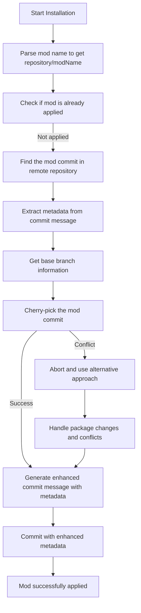
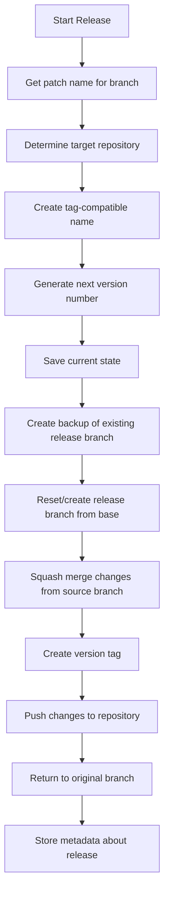
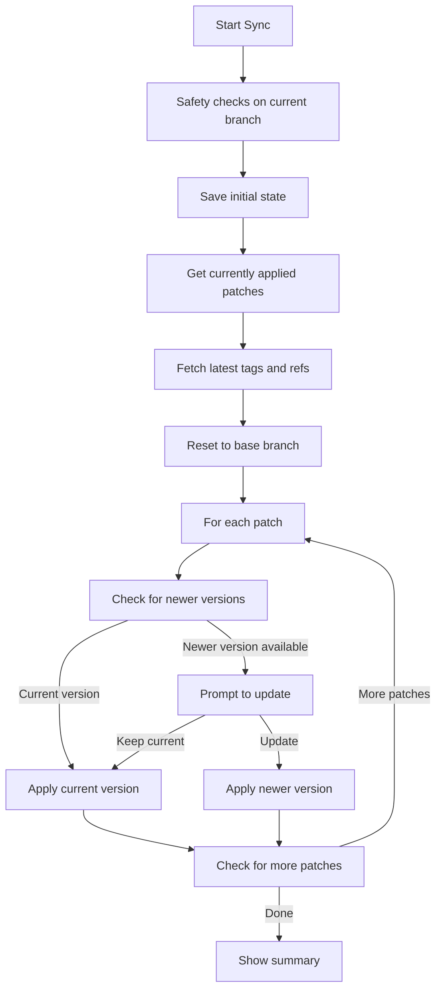
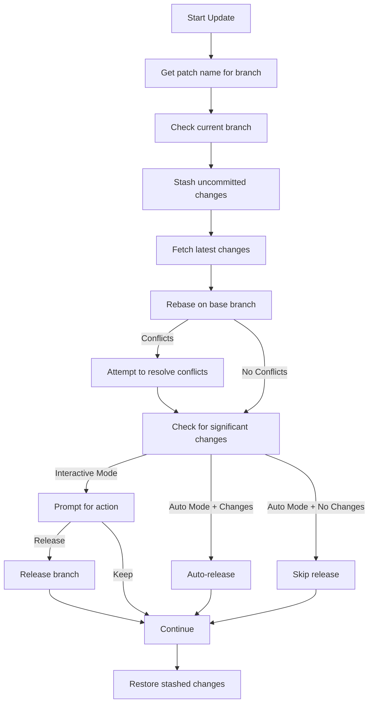

hypkg is a thin (but opinionated) layer on top of git commands, designed to streamline the process of managing mods for projects. This article explores how hypkg works under the hood, focusing on the key operations: installing mods, releasing mods, syncing with branches, and updating development branches.

## Core Concepts

At its heart, hypkg uses Git as a foundation for version control and distribution. It introduces several conventions:

1. **Repository Structure**: Mods are stored in Git repositories with specific branch naming conventions
2. **Namespaced Mod Names**: Mods follow the format `repository/modName`
3. **Enhanced Commit Messages**: Metadata is stored in commit messages
4. **Versioning**: Git tags are used for versioning

## Installing a Mod

When you install a mod using hypkg, the following happens:



Looking at the code in `applyPatchFromRepo()`, the process works like this:

1. Parse the mod name into repository and mod components
2. Check if the mod is already applied to avoid duplication
3. Locate the mod commit in the remote repository (looking for branches with `cow_` prefix)
4. Extract metadata from the original commit message
5. Attempt to cherry-pick the commit
6. If conflicts occur (especially in package files), handle them automatically
7. Create an enhanced commit message containing metadata:
   - Original commit hash
   - Base branch hash when mod was created
   - Current base branch hash
8. Commit the changes with this enhanced metadata

The enhanced commit message is critical, storing information needed for future operations:

```
cow: repository/modName v1.0.0
---
mod-hash: abc123...
mod-base: def456...
current-base: ghi789...
```

## Releasing a Mod

When you create or update a mod and want to release it, the `releaseBranch()` function handles this:



The process involves:

1. Determining which repository to use for the release
2. Creating a "tag-compatible" name (replacing `/` with `-` for Git compatibility)
3. Finding the next version number by examining existing tags
4. Creating a backup of any existing release branch
5. Creating a clean release branch from the base branch
6. Squash-merging all changes from the source branch
7. Creating a version tag in the format `repository-modName-v1.0.0`
8. Pushing the changes and tags to the repository
9. Storing metadata about the release in Git config

This approach creates clean, atomic mods that can be easily installed by others.

## Syncing Mods with Branches

The `syncPatches()` function handles synchronizing mods with branches, which is particularly useful when upgrading the base code:



The key steps in syncing are:

1. Performing safety checks to ensure you're on the right branch
2. Getting a list of all currently applied mods with their metadata
3. Fetching the latest tags and refs
4. Resetting to the base branch (temporarily removing all mods)
5. For each mod:
   - Checking if a newer version is available
   - Applying the appropriate version (prompting for updates if available)
   - Handling any conflicts that arise
6. Showing a summary of updates

This process essentially rebuilds your mod stack on top of the latest base code, ensuring everything remains compatible.

## Updating a Development Branch

When developing a mod, you'll often need to update your development branch with the latest base code. The `updateBranch()` function handles this:



The update process:

1. Gets the patch name associated with the branch
2. Stashes any uncommitted changes to keep them safe
3. Fetches the latest changes from the base remote
4. Attempts to rebase on the latest base branch
5. Resolves conflicts automatically when possible
6. Checks if there were significant changes
7. Prompts for action (keep changes locally or create a release)
8. Restores any stashed changes

This approach ensures your development branch stays in sync with the upstream code while preserving your modifications.

## Conclusion

hypkg provides a structured, Git-based approach to mod management. By leveraging Git's distributed version control capabilities and adding a layer of conventions and metadata, it creates a powerful system for:

1. Installing mods from repositories
2. Creating and releasing new mods
3. Keeping mods up to date with the latest base code
4. Managing development branches

The system's reliance on Git means it inherits Git's strengths: distributed operation, strong history tracking, and powerful branching capabilities. The enhanced metadata in commit messages adds the context needed to manage complex mod interactions and versioning.

For developers, hypkg provides a familiar Git-based workflow with added conventions that make mod management more structured and reliable. Whether you're installing existing mods or developing new ones, hypkg's thin but opinionated layer on top of Git commands provides the right balance of flexibility and structure. 